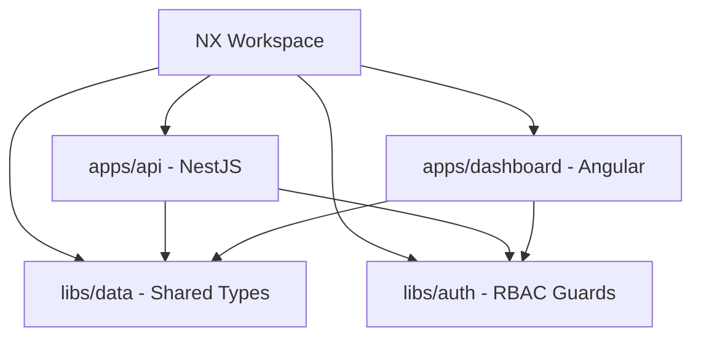
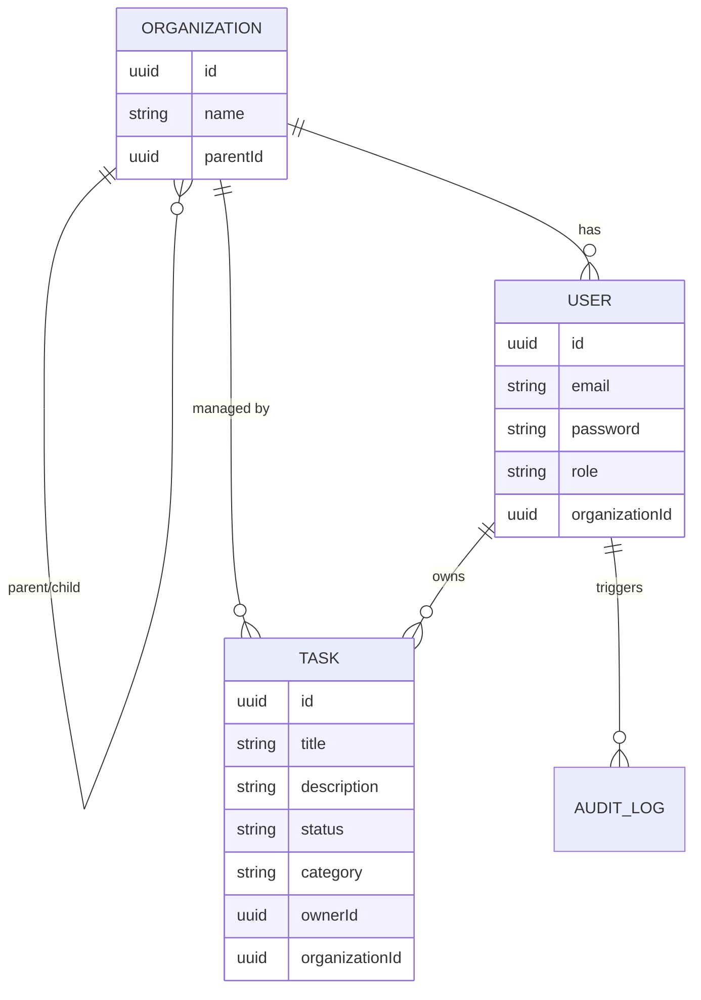

# 🚀 Full Stack Secure Task Management System

A production-grade Task Management System featuring robust **Role-Based Access Control (RBAC)**, built within a modular **NX Monorepo**. This system ensures secure data access based on user roles and a multi-level organizational hierarchy.

---

## ✨ Features

- **🔐 Premium RBAC**: Implementation of a Role Inheritance hierarchy (Owner > Admin > Viewer).
- **🏢 Organizational Scoping**: Data is automatically scoped to the user's organization and its descendants.
- **🛡️ JWT Authentication**: Secure, industrial-standard token-based authentication.
- **📋 Kanban Board**: Intuitive drag-and-drop interface for mission management.
- **📜 Audit Archive**: Comprehensive logging of all system actions (accessible to privileged roles).
- **⌨️ Keyboard Optimized**: Advanced shortcuts ('N' for New, 'F' for Filter, 'Esc' to Close) for power users.
- **🎨 Glassmorphic UI**: High-fidelity dark mode interface with smooth micro-animations.
- **📱 Responsive Design**: Seamless experience across mobile, tablet, and desktop.

---

## 🏗️ Architecture

### Monorepo Structure (NX)


### Data Model (ERD)


---

## 🚦 Getting Started

### Prerequisites
- **Node.js**: v18+
- **npm**: v9+

### Installation
1. **Clone & Install**:
   ```bash
   npm install
   ```
2. **Environment Setup**:
   Copy `.env.example` to `.env` and configure your `JWT_SECRET`.
   ```bash
   cp .env.example .env
   ```
3. **Database Seeding**:
   Initialize the system with demo organizations and users.
   ```bash
   npm run seed
   ```

### Running Locally
- **Backend**: `nx serve api` (Runs on port 3333)
- **Frontend**: `nx serve dashboard` (Runs on port 4200)

---

## 👥 Demo Credentials

| Role | Email | Password | Access Level |
|------|-------|----------|--------------|
| **Owner** | `owner@example.com` | `password` | Global Oversight |
| **Admin** | `admin@example.com` | `password` | Organizational Management |
| **Viewer** | `viewer@example.com` | `password` | Personal Task Management |

---

## 🔐 RBAC Logic & Inheritance

The system implements a weighted role hierarchy:
1.  **Owner (Weight 3)**: Inherit all Admin and Viewer permissions. Access to all system data.
2.  **Admin (Weight 2)**: Inherit Viewer permissions. Manage tasks for their organization and its sub-organizations.
3.  **Viewer (Weight 1)**: Can create and manage their own tasks only.

### Ownership Guard logic:
- **Owners**: Bypass all checks (Full System Access).
- **Admins**: Limited to resources belonging to their `organizationId`.
- **Viewers**: Limited to resources where `ownerId === userId`.

---

## 📝 API Reference

### Authentication
- `POST /api/auth/login`: Exchange credentials for a Bearer JWT.
- `POST /api/auth/register`: Create a new user profile.

### Mission Control
- `GET /api/tasks`: List accessible tasks (auto-filtered by role).
- `POST /api/tasks`: Initiate a new mission objective.
- `PUT /api/tasks/:id`: Refine task parameters or update status.
- `DELETE /api/tasks/:id`: Decouple/Archive task.

### Oversight
- `GET /api/tasks/audit-log`: Access the system's operational history (Owner/Admin only).

---

## 🧪 Testing Strategy

- **Backend**: Unit tests for `RolesGuard` inheritance and `TasksService` role-scoping using Jest.
- **Frontend**: Component testing for dashboard state and search filtering.

To run all tests:
```bash
npx nx test api
npx nx test dashboard
```

---

## 📄 License
MIT © 2026 RBAC Assessment Team
